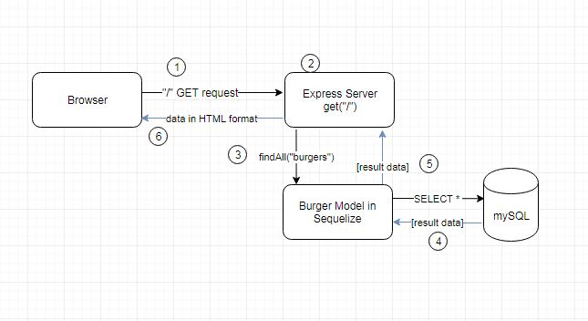

# burger-sequelize (Eat-Da-Burger Part 2!)

UCF Bootcamp Homework Week15 - Sequelize


# Contents

 * [Overview](#overview)

 * [How To Run](#howToRun)
 
 * [File Structure](#FileStructure)
 
 * [Technologies Used](#techsUsed)
 
  * [Support](#support)
 
 
### Overview <a name="overview"></a>
This version of "eat-da-burger" is the same work done for the [burger](https://github.com/j0serobles/burger) application, except for the software library used for the ORM. Instead of using a custom-made ORM library, this version uses the [sequelize](https://www.npmjs.com/package/sequelize) npm package.  Other than that, the application's purpose remains the same: to showcase using the *handlebars* view templating engine and object-relational-modeling (ORM).
The user enters a burger name in a text field in the page and adds it to a list of burgers to be devoured. Clicking the "Eat it" button moves the burger to the "devoured burgers" list.  Another button allows the user to clear the list of all devoured burgers.  Data persistence is provided by a MySQL relational database in the back end. 


### How To Run <a name="howToRun"></a>
The application has been deployed to Heroku and is accessible [here](https://ancient-shore-99109.herokuapp.com/)

A demo video can be accessed [here]https://engjoserobles-gmail.tinytake.com/tt/Mzc3NTgzOV8xMTUxMzE1MQ


### File Structure <a name="FileStructure"></a>
```
+ burger-sequelize
|   .gitignore : Files ignored by git
|   package-lock.json : Created by npm
|   package.json : Application package file. 
|   README.md : this file
|   server.js : Express httpd server logic.
|   
+---config
|       connection.js : mySQL Database configuration.
|
|       
+---routes
|       apiRoutes.js : Express routes for API calls (Controller in MVC)
|       htmlRoutes.js: Express routes for HTML documents (Controller in MVC)
|
+---models
|       burger.js : Business Object model (The burger). 
|       index.js  : Business Object logic generated by sequelize:init
|       user.js   : Business Object model for users (not used in this release). 
|       
+---node_modules : Dependencies installed by npm
|           
+---public
|   \---assets
|       +---css
|       |       style.css : CSS Styling
|       \---js
|       |   +---burgers.js : Front end logic
|       \---images
|           +---burger_get_route_process.JPG : Documentation
|               
\---views
    |   index.handlebars : HTML/Handlebars View
    |   
    +---layouts
    |       main.handlebars : Top HTML/Handlevars view. 
    |       
    \---partials
        \---burgers
                burger-block.handlebars : Handlebars partial view. 
                

```

### Technologies Used <a name="techsUsed"></a>

Eat-Da-Burger is more complex than previous works.  The full stack is used now following the MVC architectural model. 

The view uses HTML, javaScript and Handlebars (front end templating engine).

The Controller is pure javaScript logic using the Express npm module. 

The Model is implemented using javaScript objects and the Object-Relational-Mapping (ORM) is provided by the *sequelize* npm package. 

Data persistence for the model is provided by the same mySQL database as the original *buger* application.

The following diagram shows the updated interaction of the application's components during processing of the initial GET method ("/" URL in the browser): 



1) The browser makes a GET request to the listening port of the Express server (endpoint of the ```listen()``` method in Express), requesting the root document "/".

2) The Express server executes the ```get()``` method in an Express ```Router()``` object (controller code), handling the "/" route.

3) The ```get()``` method calls the ```findAll()``` method in the "burger" object model (the methods for the sequelize library have been added to the burger model).  This is a sequelize ORM method, which connects to the database and retrieves all the burger records(4).

4) The result data is sent to the ```render()``` method in the controller code (5) , which generates the HTML via the *handlebars* view engine, and  sends it back to the browser (6). 

### Support <a name="support"></a>
  If you have any issues using the app, send me a notification at [engjoserobles@gmail.com](mailto:engjoserobles@gmail.com)
  
